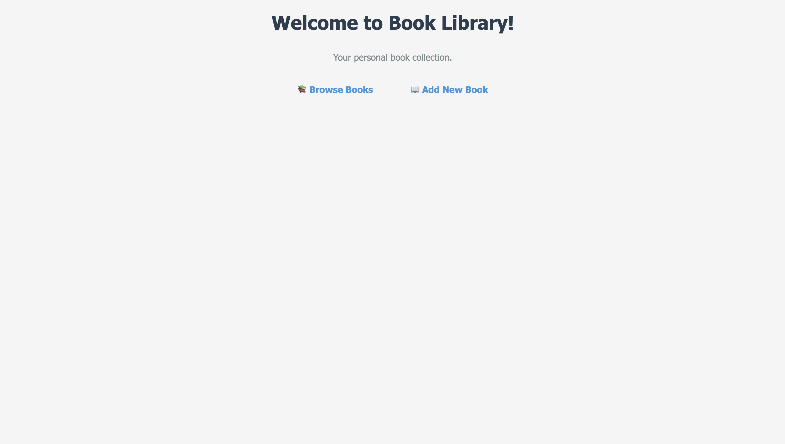

# Personal Library App

This app is a Personal Library management system that allows users to add, view, and manage their book collection.

## Screenshots

## Attributions

This is a lab submission for Adobe Digital Academy coursework.

## Technologies Used

MongoDB, Express, Node.js, and EJS.